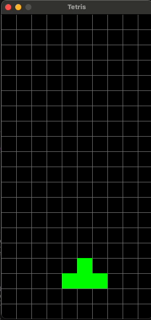

# Tetris Game

A simple Tetris implementation using Pygame.
This game was created as a learning exercise for Pygame with ChatGPT (o1-preview) and cursor in less than half an hour.





## Prerequisites

- Python 3.8 or higher
- Poetry (Python package manager)

## Installation

1. Clone this repository:
```bash
git clone <repository-url>
cd tetris
```

2. Install Poetry (if you haven't already):
```bash
curl -sSL https://install.python-poetry.org | python3 -
```

3. Install project dependencies:
```bash
poetry install
```

## Running the Game

You can run the game in two ways:

1. Using Poetry run directly:
```bash
poetry run python tetris/main.py
```

2. Or by activating the Poetry shell first:
```bash
poetry shell
python tetris/main.py
```

## Controls

- Left Arrow: Move piece left
- Right Arrow: Move piece right
- Down Arrow: Move piece down faster
- Up Arrow: Rotate piece

## Development

To add new dependencies:
```bash
poetry add package-name
```

To update dependencies:
```bash
poetry update
```
